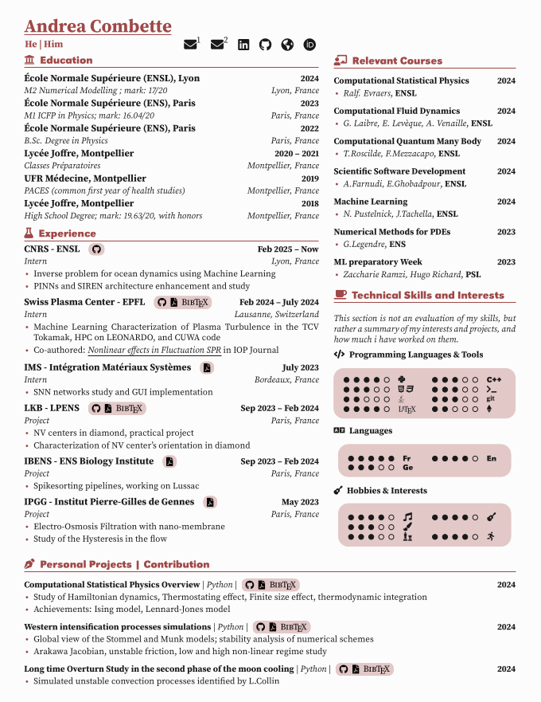
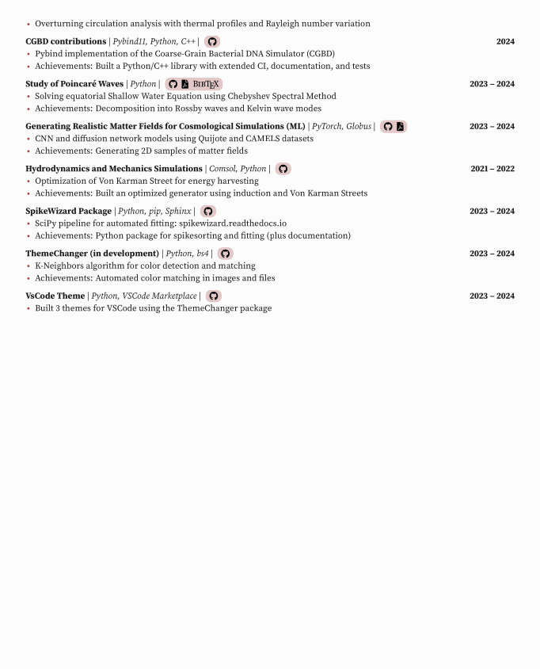

# CV Template

This repository contains the LaTeX source code for a academic curriculum vitae (CV). The template is based on Jake Gutierrez's template LaTeX resume template and is customized for academic and technical profiles.

## Preview

Below is a preview of the generated CV PDF (front and back):

<table>
  <tr>
    <td align="center"></td>
    <td align="center"></td>
  </tr>
  <tr>
    <td align="center">Page 1</td>
    <td align="center">Page 2</td>
  </tr>
</table>

[📄 View CV PDF](cv.pdf)

## Features

- Modern, clean two-column layout
- Customizable skill bars and icons (FontAwesome5)
- Sections for education, experience, projects, courses, and skills
- Hyperlinks to publications, code, and profiles

## Requirements

- **LaTeX** distribution (e.g., TeX Live, MiKTeX)
- The following LaTeX packages:
  - `fontawesome5`
  - `tcolorbox`
  - `tikz`
  - `tabularx`
  - `multicol`
  - `hvlogos`
  - `sourceserifpro`
  - `titlesec`
  - `enumitem`
  - `hyperref`
  - `fancyhdr`
  - `xcolor`
  - `babel`
  - `fullpage`
  - `latexsym`


## Building the CV

To compile the CV, run:

```bash
pdflatex cv.tex
```

You may need to run the command twice to resolve references and hyperlinks.

## Customization

- Edit `cv.tex` to update your personal information, education, experience, and projects.
- Adjust colors and layout by modifying the color definitions and section formatting in the preamble.

## License

This project is licensed under the MIT License. See [LICENSE](LICENSE) for details.

This template is based on [Jake Gutierrez's template](https://github.com/jakegut/resume).

---
